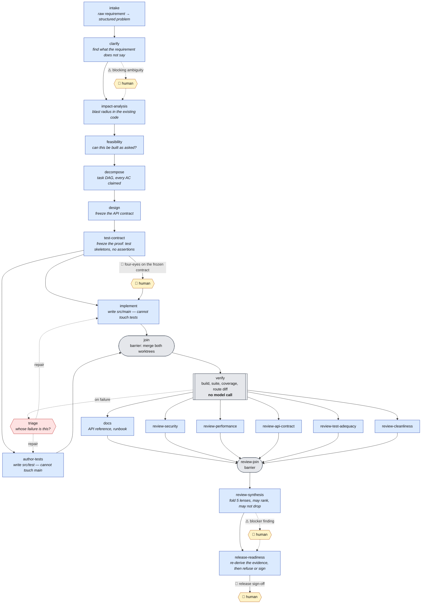
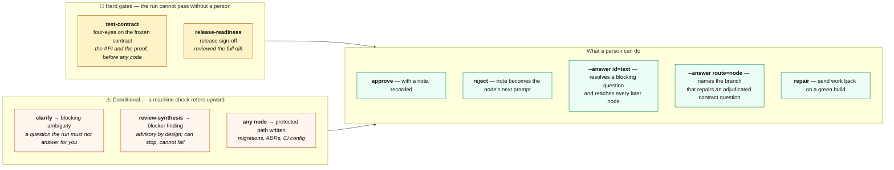
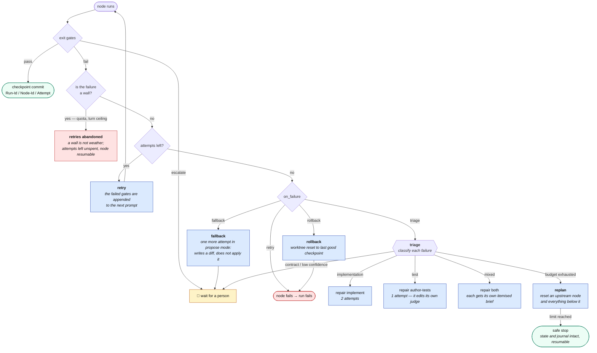

# The graph, illustrated

Four views of the same 21-node pipeline, from "what runs" to "what stops it".
Everything here is generated from
[`orchestrator/pipelines/sdlc.yaml`](../orchestrator/pipelines/sdlc.yaml) — the
graph is declarative, so this page and the executable definition cannot drift
far without one of them being obviously wrong.

Legend, used in every diagram:

- 🟦 **agent** — a node that calls a model
- ⬛ **deterministic / barrier** — no model call at all
- 🟥 **handler** — invoked by a failure, never scheduled
- 🛑 **human gate** — the run stops here until a person decides
- ⚠️ **escalation** — a machine check that can only refer upward, never approve

---

## 1. The flow, end to end

**Two fan-outs, both real concurrency.** `implement` and `author-tests` run in
separate git worktrees and are denied each other's paths; the six post-`verify`
nodes run concurrently and are merged by a barrier. Nothing special-cases
either — a node is ready when its dependencies have passed, and that one rule
produces both.

---

## 2. Where a human decides

Four places, and they are not the same kind of stop.

> **The rule underneath all four:** the LLM never approves. It can satisfy a
> checkable predicate, or it can escalate — enforced when the pipeline *loads*,
> not by convention ([ADR-001](adr/001-the-llm-never-approves.md)).

---

## 3. What happens when something fails

**Why the asymmetry.** `implement` gets two repair attempts and `author-tests`
one, because repairing a test is the single case where an agent edits the thing
that judges it — and the obvious way to make a failing test pass is to delete it.
`tests_not_weakened` records its own baseline for the same reason
([ADR-003](adr/003-segregation-of-duties.md),
[ADR-006](adr/006-bounded-repair-with-human-routing.md)).

---

## 4. What each node does

| Node | Kind | In one line | Its own gate worth knowing |
|---|---|---|---|
| `intake` | agent | Turns a raw requirement into a structured problem with acceptance criteria | every AC is traceable to a sentence in the requirement |
| `clarify` | agent | Finds what the requirement does not say, and refuses to invent it | ⚠️ blocking ambiguities escalate; assumptions are required *even when there are none* |
| `impact-analysis` | agent | Blast radius against the existing codebase — modules, APIs, data flows | — |
| `feasibility` | agent | Can this be built as asked, with what is here? | — |
| `decompose` | agent | The task DAG | plan is a DAG; every acceptance criterion is claimed by a task |
| `design` | agent | Freezes the API contract | OpenAPI lints; the contract is content-hashed |
| `test-contract` | agent | Freezes *the proof*: test classes and method names, structure only | **no assertions** — deciding what counts as proof is the other branch's job; 🛑 four-eyes |
| `implement` | agent | Writes `src/main/**`; **denied** `src/test/**` | contract unchanged where it may not write; compiles; paths confined |
| `author-tests` | agent | Writes `src/test/**`; **denied** `src/main/**` | suite may not shrink, against a baseline the gate records itself |
| `join` | barrier | Merges both worktrees | ⚠️ a conflict escalates rather than being resolved by a model |
| `verify` | deterministic | Build, full suite, coverage floor, route-vs-contract diff. **No model call** | on failure → `triage` |
| `triage` | handler | Classifies each failure and routes it to the branch that owns it | contract questions and low confidence go to a person |
| `docs` | agent | API reference and runbook | links resolve; `fallback` on failure |
| `review-security` | agent | One of five independent lenses, each its own worktree and artifact | — |
| `review-performance` | agent | " | — |
| `review-api-contract` | agent | " | — |
| `review-test-adequacy` | agent | " | — |
| `review-cleanliness` | agent | " | — |
| `review-join` | barrier | Rejoins the five lenses | — |
| `review-synthesis` | agent | Folds five reviews into one brief. **Advisory: may rank, may not drop** | every lens finding is preserved, checked mechanically; ⚠️ blockers escalate |
| `release-readiness` | agent | Re-derives the evidence rather than trusting the journal, then refuses or signs | 🛑 release sign-off |

---

## 5. The same graph, as it actually ran

`greenfield-3`, compressed. The dotted paths are the ones a happy-path diagram
never shows, and they are most of what the pipeline is for.

```mermaid
flowchart LR
    A[intake → design] --> B[test-contract]
    B -->|🛑 approved| C[implement ∥ author-tests]
    C --> D([join]) --> E[[verify]]
    E -.->|23 failures<br/>7 classes| F{{triage}}
    F -.->|mixed verdict| C
    C --> D2([join]) --> E2[[verify]]
    E2 -.->|1 failure left| F2{{triage}}
    F2 -.->|contract question| G[🛑 human rules:<br/>the test over-asserts]
    G -.->|route=author-tests| H[author-tests repairs]
    H --> E3[[verify ✓ 148 tests]]
    E3 --> I[docs + 5 lenses] --> J[review-synthesis]
    J -.->|⚠️ blocker| K[🛑 human accepts the risk]
    K --> L[release-readiness]
    L -->|ready: false| M[🛑 human signs off anyway<br/>residuals recorded]

    classDef human fill:#fef3c7,stroke:#b45309,color:#111
    classDef mech fill:#e5e7eb,stroke:#374151,color:#111
    class G,K,M human
    class D,D2,E,E2,E3 mech
```

Full account: [`fixtures/runs/greenfield-3/README.md`](../orchestrator/fixtures/runs/greenfield-3/README.md).
